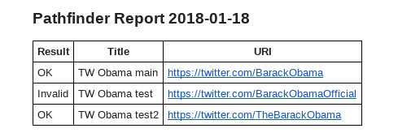

# Path Finder
> Report on whether a list of URIs are valid or not


## Installation

Linux and Mac OS:

```bash
$ git clone git@github.com:MichaelCurrin/pathfinder.git
```

See [System Installation](docs/SystemInstallation.md) document for setup instructions.


## Usage example

### Usecases

- **Web hosting**: Check whether a certain web domain or close variations are available before your try to buy one.
- **Account names**: Check whether a namespace on an external site is available, such as [thisisme123.wix.com]() or [pythonanywhere.com/thisisme123]().
- **Social media usernames**: Check once-off or regularly whether usernames (handles) are in use. Examples are below.
    * You want a specific handle on Instragram which is your firstname and lastname and you want to be first to know if it ever becomes available, so that you can be take it.
    * You are interested to see the use of handles on Twitter around a celebrity and find out if they change their handle something else, leaving the old one open.
    * You have a list of potential usernames to register around your name or your company's name and you want wish to see which ones are available on a specific platform, or across a set of platforms such as Facebook, Twitter and Instagram.


#### Output

An example command, shown with terminal and email output.

```bash
$ python pathfinder file pathfinder/var/lib/presidents.csv
Result     Title                URI
===================================
OK         TW Obama main        https://twitter.com/BarackObama
Invalid    TW Obama test        https://twitter.com/BarackObamaOfficial
OK         TW Obama test2       https://twitter.com/TheBarackObama
Invalid    TW Obama test3       https://twitter.com/Barack_Obama
Sending mail with 4 matched rows.
Sent mail.
```




For detailed usage instructions, see the [Usage](docs/Usage.md) document.
